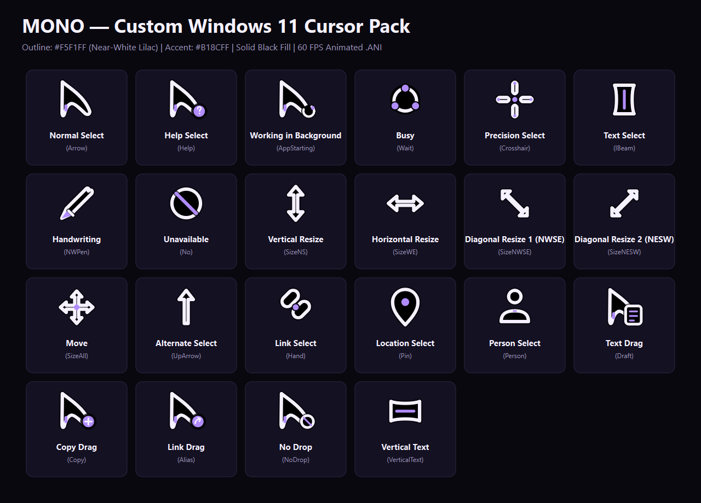
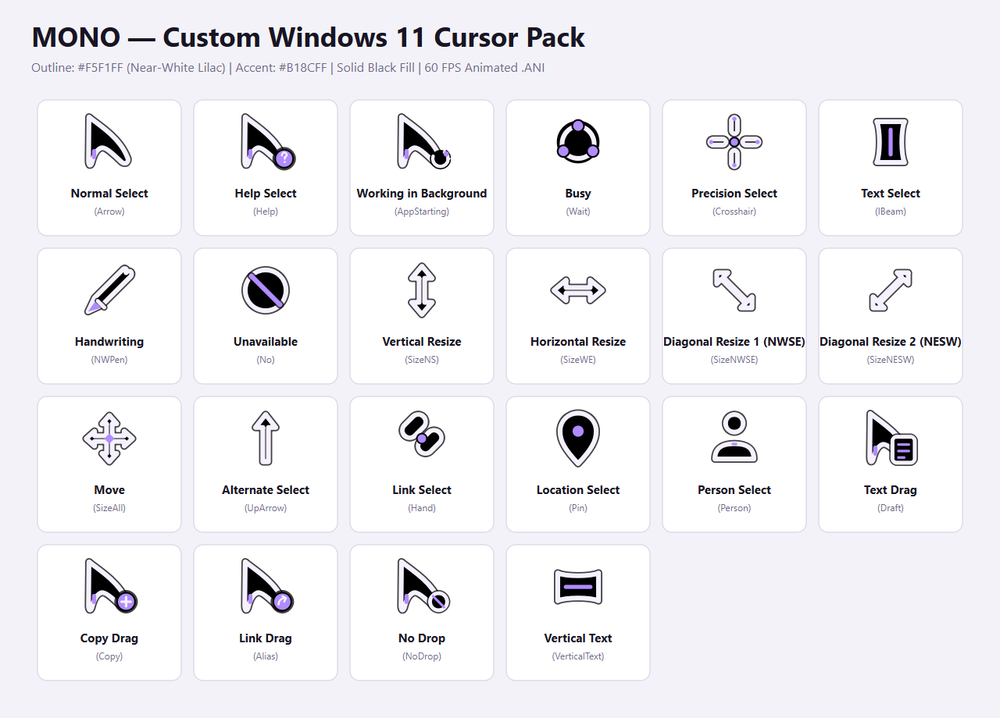

# MONO — Windows 11 Custom Lilac-White Cursor Pack

> **A minimal, futuristic hollow cursor pack designed for Windows 11.**  
> Crafted with a warm near-white lilac outline (`#F5F1FF`), solid black interior core (`#000000`), vibrant interaction accent dots (`#B18CFF`), and a protective dark outer contrast halo (`rgba(0,0,0,0.75)`) ensuring readability on both dark themes and pure white backgrounds.

---

## 📸 Visual Showcase

### Dark Theme Preview


### Light Theme Preview


---

## 🎨 Design System & Palette

| Token | Hex / Value | Description |
|---|---|---|
| **Outline Stroke** | `#F5F1FF` | 90% white, 10% lilac (HSL 256°, 45%, 96%). Warm, crisp, and non-clinical. |
| **Accent Fill** | `#B18CFF` | Saturated interaction accent for interactive focal points, spinners, and badges. |
| **Interior Core** | `#000000` | Solid opaque black interior body preventing pass-through and ensuring visibility across all UI colors. |
| **Contrast Halo** | `rgba(0,0,0,0.75)` | Dark outer protective stroke preventing the cursor from vanishing on white websites and documents. |
| **Stroke Width** | `5.2px` | Bold, tactile silhouette with rounded caps and joins (`round`). |

---

## 📦 What's Included

### 1. Windows Cursors (`dist/`)
Contains all **compiled multi-resolution Windows cursors** embedded with 7 resolutions (**16×16, 24×24, 32×32, 48×48, 64×64, 96×96, 128×128 px**) and pixel-exact hotspots:

| Cursor Name | Windows Role | File | Features |
|---|---|---|---|
| **Normal Select** | `Arrow` | `mono_normal_select.cur` | Flagship curved pointer with purple heel pill |
| **Help Select** | `Help` | `mono_help_select.cur` | Pointer + question mark circle badge |
| **Working in Background** | `AppStarting` | `mono_working_in_background.ani` | Pointer + 60 FPS rotating spinner ring |
| **Busy / Wait** | `Wait` | `mono_busy.ani` | 60 FPS smooth rotating tri-arc spinner with 3 purple dots |
| **Precision Select** | `Crosshair` | `mono_precision_select.cur` | 4-segment crosshair with center dot & 4 outer purple tips |
| **Text Select** | `IBeam` | `mono_text_select.cur` | Sculpted I-beam with center purple accent bar |
| **Handwriting** | `NWPen` | `mono_handwriting.cur` | Diagonal stylus with solid black body & purple lead tip |
| **Unavailable** | `No` | `mono_unavailable.cur` | Lilac circle with diagonal purple slash |
| **Vertical Resize** | `SizeNS` | `mono_vertical_resize.cur` | Double-headed vertical arrow |
| **Horizontal Resize** | `SizeWE` | `mono_horizontal_resize.cur` | Double-headed horizontal arrow |
| **Diagonal Resize 1** | `SizeNWSE` | `mono_diagonal_resize_1.cur` | Northwest-to-Southeast diagonal resize arrow |
| **Diagonal Resize 2** | `SizeNESW` | `mono_diagonal_resize_2.cur` | Northeast-to-Southwest diagonal resize arrow |
| **Move** | `SizeAll` | `mono_move.cur` | 4-way move arrow with center purple pivot diamond |
| **Alternate Select** | `UpArrow` | `mono_alternate_select.cur` | Upward vertical arrow |
| **Link Select** | `Hand` | `mono_link_select.cur` | Interlocking rounded chain links with center accent |
| **Location Select** | `Pin` | `mono_location_select.cur` | Map pin teardrop with purple center core |
| **Person Select** | `Person` | `mono_person_select.cur` | User avatar silhouette with collar accent |

---

## 🚀 How to Install & Apply

### ⚡ Option 1: One-Click Instant Activation (Recommended)
Double-click:
```text
apply_mono.bat
```
*(Or in PowerShell: `powershell -ExecutionPolicy Bypass -File apply_mono.ps1`)*  
**Instantly applies the cursors to your desktop live via Windows Win32 API — no restart or logoff required!**

---

### 🪟 Option 2: Standard Windows INF Installation
1. Open the [`install/`](install/) folder.
2. Right-click **`install_mono.inf`** and select **Install**.
3. Press `Win + R`, type `main.cpl`, and hit **Enter**.
4. In the **Pointers** tab, select **Mono** from the Scheme dropdown and click **Apply**.

---

### 🔄 How to Revert to Default
Double-click:
```text
restore_default.bat
```
*(Or in PowerShell: `powershell -ExecutionPolicy Bypass -File restore_default.ps1`)*

---

## 🧪 Interactive Testing Tools

- **Desktop Cursor Tester**: Run `test_busy.bat` to launch the native live cursor tester with simulated heavy CPU workloads.
- **Browser Cursor Studio**: Open [`test_busy.html`](test_busy.html) in any browser to inspect every cursor state with live interactive triggers.

---

## 🛠️ Rebuilding from Source

To modify colors, geometry, or rebuild all multi-resolution binary containers:
```powershell
py src/make_pack.py
```
This automatically builds master SVGs, renders transparent PNGs across all 7 resolutions, packs the binary `.cur` and 60 FPS animated `.ani` containers, updates registry scripts, and re-renders the high-resolution showcase graphics.

---

## 📄 License & Credits
Designed and maintained by **Tushar** ([@Tushar27-git](https://github.com/Tushar27-git)). Free to use and customize!
